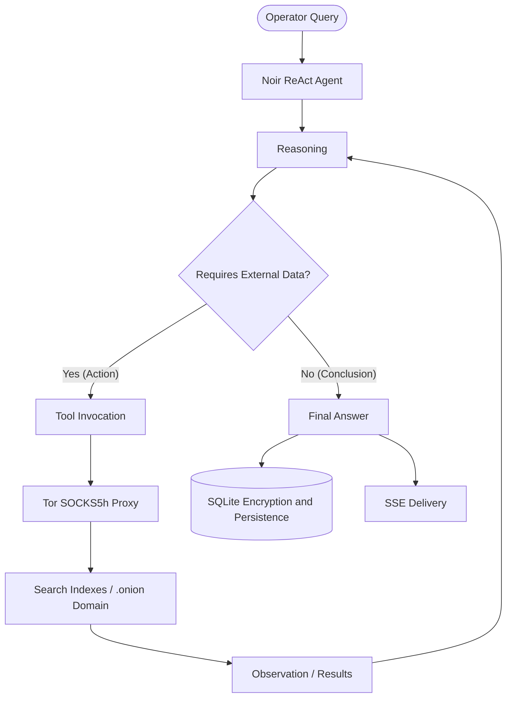

# Noir: Autonomous Agent for Search and Analysis on the Tor Network

Noir is an autonomous research agent designed to search and analyze content on the Tor network. It utilizes the **ReAct (Reasoning + Action)** architecture to dynamically determine which network tools to execute and processes answers using language models via the **Venice AI** API.

The system provides an isolated environment for intelligence gathering and information analysis (OSINT) on hidden services (.onion).

---

## Technical Features

*   **ReAct Engine**: Implements a structured thought, action, and observation cycle (Thought -> Action -> Observation) to resolve complex queries sequentially.
*   **Network Isolation**: Routes all traffic to `.onion` domains through a local SOCKS5h proxy (`127.0.0.1:9150`), resolving DNS names directly on the Tor proxy to prevent leaks (DNS leaks).
*   **Integrated Search**: Connectors to automatically query the Ahmia and TorDex search engine indexes.
*   **Encrypted Persistence**: Local SQLite database that encrypts message history, reasoning traces, and session metadata using AES-256-GCM.
*   **User Interface**: Web client supporting multiple independent chat threads, consuming responses in real time via Server-Sent Events (SSE).
*   **LaTeX and Markdown Support**: Renders mathematical equations using KaTeX and parses rich text formatting.
*   **v2 Address Filter**: Automatic validation that discards requests to obsolete v2 `.onion` addresses (16 characters).

---

## System Requirements

1.  **Environment**: Node.js v18.0.0 or higher.
2.  **Tor Proxy**: Active local Tor instance listening on the standard SOCKS5 port (`127.0.0.1:9150`). This can be provided by the Tor Browser or a system daemon.
3.  **Credentials**: Configured Venice AI API Key.

---

## Installation and Configuration

1.  Install dependencies:
    ```bash
    npm install
    ```
2.  Create the configuration file:
    ```bash
    cp .env.example .env
    ```
3.  Set the required variables in the `.env` file:
    ```ini
    VENICE_API_KEY=your_venice_api_key_here
    VENICE_MODEL=deepseek-v4-flash
    TOR_PROXY_URL=socks5h://127.0.0.1:9150
    ```
    *(The symmetric key `DB_ENCRYPTION_KEY` is auto-generated on the first run if not defined).*

---

## Execution

### Web Interface (Recommended)
Start the backend server and local control panel:
```bash
npm run ui
```
The panel will be available at: **http://localhost:3000**

### Command Line Interface (CLI)
To run interactive sessions directly in the terminal:
```bash
npm start
```

---

## Data Flow Architecture



---

## Disclaimer

This software is developed solely for security research and network forensics. The use of this agent to interact with illicit resources or perform unauthorized activities is the sole responsibility of the operator. The developers assume no liability for any damage resulting from the use of this software.
